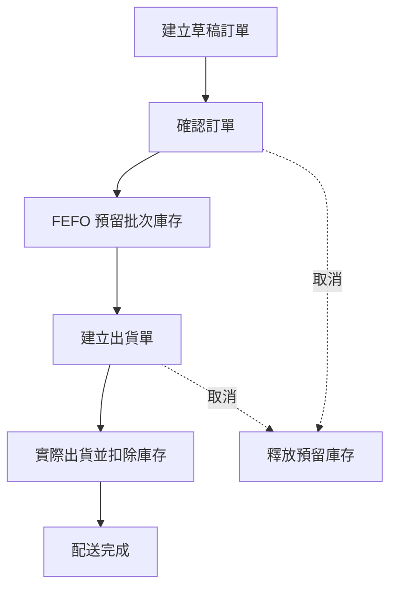
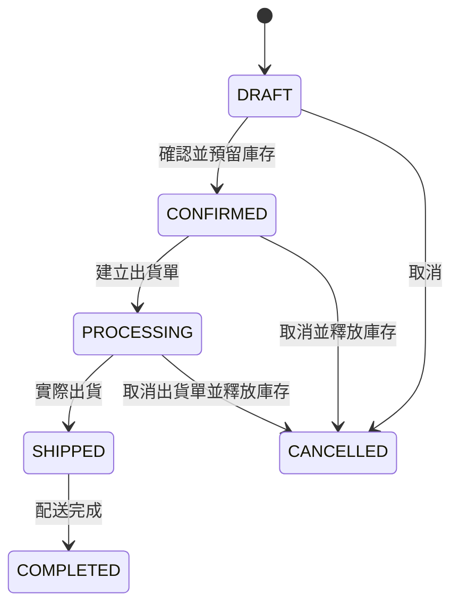

# StockFlow API

StockFlow 是一套以 **Spring Boot** 開發的 B2B 訂單與庫存管理系統後端 API，整合商品、供應商、客戶、批次庫存、訂單與出貨流程。

系統以批次追蹤庫存，採用 **FEFO（First Expired, First Out，先到期先出）** 自動配置庫存，並透過悲觀鎖與交易控制降低併發預留、取消及出貨時發生超賣或資料不一致的風險。

> 目前專案以後端 API 為主；Angular 21 前端、JWT 登入與 RBAC 權限管理尚待實作。

## 專案特色

- 商品分類、商品、客戶與供應商資料管理
- 批次庫存及有效期限追蹤
- FEFO 跨批次庫存預留
- 庫存入庫、調整、預留、釋放及實際出庫
- 完整庫存異動紀錄
- 訂單建立、確認、取消及狀態控管
- 出貨單建立、實際出貨與配送完成
- 訂單、出貨單、庫存批次與異動紀錄分頁查詢
- Jakarta Validation 請求參數驗證
- 統一 API 回應與全域例外處理
- Flyway 資料庫版本管理
- JPA 悲觀鎖、`@Transactional` 與 Entity `@Version` 併發控制
- 敏感設定透過環境變數管理

## 技術棧

| 類別 | 技術 |
| --- | --- |
| Language | Java 17 |
| Framework | Spring Boot 4.1.0 |
| Build Tool | Gradle Groovy |
| Persistence | Spring Data JPA / Hibernate |
| Database | MySQL 8.0 |
| Migration | Flyway |
| Validation | Jakarta Validation |
| Security | Spring Security、JJWT 0.11.5（JWT 尚待實作） |
| Utilities | Lombok |
| Testing | Postman、Spring Boot Test |
| Planned Frontend | Angular 21 |

## 系統架構

專案採用分層架構，並使用 Request／Response DTO 隔離 API 與 Entity：

```text
Controller → Service → Repository → MySQL
     ↓           ↓
Request DTO   Transaction / Business Rules
     ↓
Response DTO → ApiResponse
```

主要 package：`com.tp6pin.stockflow`

## 核心業務流程



### 訂單狀態



`SHIPPED`、`COMPLETED` 與 `CANCELLED` 訂單不可取消；已出貨訂單未來將透過退貨流程處理。

### 出貨狀態

- `PREPARING`：備貨中
- `SHIPPED`：已出貨
- `DELIVERED`：配送完成
- `CANCELLED`：已取消
- `FAILED`：狀態已保留，配送失敗與重新配送流程尚未實作

### 庫存異動類型

| 類型 | 說明 |
| --- | --- |
| `INBOUND` | 商品入庫 |
| `ADJUSTMENT` | 手動增加或減少庫存 |
| `RESERVE` | 預留庫存 |
| `RELEASE` | 釋放預留庫存 |
| `SHIPMENT` | 實際出庫 |

可用庫存由 `quantityOnHand - quantityReserved` 計算。實際出貨時會同時扣除現有數量與預留數量，並保留出貨後的庫存快照。

## 功能模組

### 基礎資料

- Category：建立、更新、啟用／停用、單筆及分頁搜尋
- Customer：建立、更新、啟用／停用、單筆及分頁搜尋
- Supplier：建立、更新、啟用／停用、單筆及分頁搜尋
- Product：建立、更新、啟用／停用、依關鍵字與分類分頁搜尋

### 庫存管理

- 新增批次或對既有批次入庫
- 手動增加／減少庫存並檢查庫存下限
- 依有效期限執行 FEFO 跨批次預留
- 依來源釋放預留庫存
- 僅允許針對已預留數量執行出庫
- 查詢單一批次、批次分頁、即將到期批次及庫存異動紀錄

### 訂單管理

- 建立與修改草稿訂單
- 新增、修改及移除訂單商品
- 防止同一訂單重複加入相同商品
- 自動計算未稅金額、5% 稅額與總金額
- 確認訂單時自動預留庫存並建立批次配置
- 依訂單狀態執行取消與庫存釋放
- 依關鍵字、客戶、狀態及日期區間組合查詢

### 出貨管理

- 為已確認訂單建立出貨單與出貨明細
- 實際出貨時扣除批次庫存
- 驗證物流追蹤編號唯一性
- 完成配送並同步完成訂單
- 依關鍵字、訂單、狀態及日期區間組合查詢

## 主要 API

| 模組 | Base Path | 主要功能 |
| --- | --- | --- |
| 商品分類 | `/api/categories` | CRUD、啟用／停用、搜尋 |
| 客戶 | `/api/customers` | CRUD、啟用／停用、搜尋 |
| 供應商 | `/api/suppliers` | CRUD、啟用／停用、搜尋 |
| 商品 | `/api/products` | CRUD、啟用／停用、搜尋 |
| 庫存 | `/api/inventory` | 入庫、調整、預留、釋放、出庫與查詢 |
| 訂單 | `/api/orders` | 草稿維護、確認、取消與查詢 |
| 出貨 | `/api/shipments` | 建立、出貨、配送完成與查詢 |

### 核心端點範例

```http
POST /api/inventory/inbound
POST /api/inventory/adjustments
POST /api/inventory/reservations
POST /api/inventory/reservations/release
POST /api/inventory/shipments
GET  /api/inventory/batches
GET  /api/inventory/batches/expiring?days=30
GET  /api/inventory/transactions

POST /api/orders?createdById={userId}
GET  /api/orders
POST /api/orders/{orderId}/confirm
POST /api/orders/{orderId}/cancel

POST /api/shipments?orderId={orderId}&createdById={userId}
GET  /api/shipments
POST /api/shipments/{shipmentId}/ship
POST /api/shipments/{shipmentId}/complete
```

## 資料庫設計

目前共有 14 張主要資料表：

| 領域 | 資料表 |
| --- | --- |
| Security / RBAC | `users`、`roles`、`user_roles` |
| Master Data / Inventory | `categories`、`products`、`suppliers`、`inventory_batches`、`inventory_transactions` |
| Order / Shipment | `customers`、`orders`、`order_items`、`order_item_allocations`、`shipments`、`shipment_items` |

`order_item_allocations` 記錄每筆訂單商品實際配置到哪些庫存批次，使訂單確認、取消、出貨及庫存異動之間具備可追蹤性。

目前尚未建立採購單、退貨及重新配送相關資料表與流程。

## 併發與資料一致性

主要寫入流程以 `@Transactional` 管理，庫存批次採悲觀寫入鎖，避免同一批次被同時預留、釋放或出庫而超賣。

為降低不同流程鎖定順序不一致造成死鎖的風險，目前統一採用下列順序：

- 實際出貨：`Order → Shipment → InventoryBatch`
- 配送完成：`Order → Shipment`
- 取消處理中訂單：`Order → Shipment → InventoryBatch`

## 快速開始

### 環境需求

- JDK 17
- MySQL 8.0+
- 專案內附 Gradle Wrapper，無須另外安裝 Gradle

### 1. 建立資料庫

建立 MySQL 資料庫並確認使用 `utf8mb4` 編碼。資料表結構由 Flyway migration 管理，Hibernate 設為 `validate`，不會自動建立或修改資料表。

### 2. 設定環境變數

Windows PowerShell：

```powershell
$env:DB_URL="jdbc:mysql://localhost:3306/order_inventory_system?useSSL=false&serverTimezone=Asia/Taipei&characterEncoding=utf8"
$env:DB_USERNAME="root"
$env:DB_PASSWORD="your_password"
$env:JWT_SECRET="replace-with-a-secure-secret"
$env:JWT_EXPIRATION_MS="86400000"
```

macOS / Linux：

```bash
export DB_URL='jdbc:mysql://localhost:3306/order_inventory_system?useSSL=false&serverTimezone=Asia/Taipei&characterEncoding=utf8'
export DB_USERNAME='root'
export DB_PASSWORD='your_password'
export JWT_SECRET='replace-with-a-secure-secret'
export JWT_EXPIRATION_MS='86400000'
```

請勿將真實密碼或 JWT Secret 提交至 Git。

### 3. 啟動專案

Windows：

```powershell
.\gradlew.bat bootRun
```

macOS / Linux：

```bash
./gradlew bootRun
```

預設服務位址：`http://localhost:8080`

### 4. 執行測試

Windows：

```powershell
.\gradlew.bat test
```

macOS / Linux：

```bash
./gradlew test
```

## API 回應格式

所有 API 使用統一的 `ApiResponse` 格式，分頁查詢則以 `PageResponse` 回傳資料與頁面資訊。請求資料會透過 Jakarta Validation 驗證，業務規則錯誤由 `BusinessException`、`ErrorCode` 與全域例外處理器統一轉換為 HTTP 回應。

## 目前開發狀態

### 已完成

- 基礎資料 CRUD、啟用／停用與分頁搜尋
- 批次庫存完整進出流程及異動追蹤
- FEFO 跨批次預留與釋放
- 訂單建立、確認、取消及多條件查詢
- 出貨、配送完成及多條件查詢
- 主要併發流程的鎖定順序統一
- Postman 主要正常與錯誤情境測試

### 待開發

- JWT 登入與 Spring Security RBAC
- 從登入使用者取得 `createdById`
- Angular 21 管理後台
- 自動化單元測試與整合測試補強
- OpenAPI / Swagger 文件
- 採購單與進貨流程
- 退貨、配送失敗及重新配送流程
- 部署與 CI/CD

## Security 注意事項

目前 `SecurityConfig` 使用 `authorize.anyRequest().permitAll()`，僅適合開發環境。JJWT 相依套件與 JWT 環境變數已準備，但正式登入、Token 驗證與角色權限尚未實作，因此目前版本不應直接部署至公開正式環境。

## 專案作者

[tp6pin](https://github.com/tp6pin)

